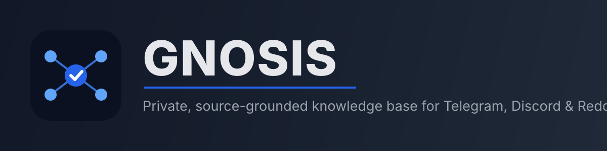

<p align="center">
  
</p>

<p align="center">
  
  
  
  
</p>

<p align="center"><i>A private, source-grounded knowledge base for Telegram, Discord, and Reddit. Collect authorized community content, filter noise, generate weekly digests, and ask questions with citations back to the original messages.</i></p>

---

## Overview

Gnosis turns selected online communities into a searchable personal knowledge base. It collects content through official platform APIs, enriches and embeds useful messages, and stores everything in PostgreSQL with pgvector.

Answers are generated only from retrieved content and include links to the original platform messages whenever available.

### Key features

- Official connectors for **Telegram**, **Discord**, and **Reddit**
- Explicit source allowlist
- Idempotent ingestion and message update handling
- Relevance filtering, tagging, chunking, and embeddings
- Hybrid PostgreSQL full-text and pgvector retrieval
- Source-grounded RAG answers with validated citations
- Weekly cited digests
- Private web interface protected with HTTP Basic authentication
- Reproducible deployment with Docker Compose

## Architecture

<div align="center">

```text
Telegram ─┐
Discord  ─┼─> Async worker ─> Filter & embed ─> PostgreSQL + pgvector
Reddit   ─┘                                      │
                                                   ├─> Hybrid RAG search
                                                   ├─> Weekly digest
                                                   └─> FastAPI web interface
```

</div>

| Component | Technology | Purpose |
|---|---|---|
| Collectors | Telethon, discord.py, asyncpraw | Authorized platform ingestion |
| Processing | Python, OpenAI API | Filtering, classification, chunking, embeddings |
| Storage | PostgreSQL 16, pgvector | Messages, metadata, full-text index, vectors |
| Application | FastAPI, vanilla HTML/CSS/JS | Private chat, sources, and digest archive |
| Operations | Docker Compose | Database, worker, and web services |

## 🚀 Quick start

### Requirements

- Docker with Compose
- A free API key for chat (embeddings run locally, no key needed) — see [Configuration](#configuration)
- Credentials for each enabled platform (optional, can be added later)

### Guided install (recommended)

```bash
git clone https://github.com/PrimeBuild-pc/Gnosis.git
cd Gnosis
./install.sh
```

Walks you through the admin password, a free chat provider (OpenRouter/Groq/NVIDIA NIM/OpenAI), and optional platform credentials, then builds/pulls the image and starts everything. Re-run it any time to reconfigure — it never overwrites values you don't touch.

If Telegram is enabled, run `docker compose run --rm worker gnosis telegram-login` once afterwards to create the session (not automated — it needs an interactive phone/OTP login).

### Manual install

<details>
<summary>Expand for the step-by-step manual setup</summary>

```bash
git clone https://github.com/PrimeBuild-pc/Gnosis.git
cd Gnosis
cp .env.example .env
cp config/sources.example.toml config/sources.toml
```

Edit `.env` and `config/sources.toml` with your credentials and allowlisted source IDs. Both files are excluded from Git.

```bash
docker compose build
docker compose run --rm web gnosis db-init
docker compose run --rm worker gnosis telegram-login  # skip if Telegram is disabled
docker compose up -d
```

</details>

Open <http://127.0.0.1:8080> and sign in with `GNOSIS_USERNAME` and `GNOSIS_PASSWORD`.

## Configuration

| Variable | Required | Description |
|---|---:|---|
| `DATABASE_URL` | Yes | PostgreSQL connection URL |
| `GNOSIS_EMBEDDING_PROVIDER` | No | `local` (default, free, runs in-container via fastembed) or `openai` |
| `GNOSIS_EMBEDDING_MODEL` / `GNOSIS_EMBEDDING_DIMENSIONS` | No | Local embedding model and vector size (default: `sentence-transformers/paraphrase-multilingual-MiniLM-L12-v2`, 384) |
| `GNOSIS_CHAT_API_KEY` / `GNOSIS_CHAT_BASE_URL` | Yes | OpenAI-compatible chat provider (classification, RAG, digest). Point it at a free tier — OpenRouter, NVIDIA NIM, Groq — or OpenAI. Falls back to `OPENAI_API_KEY`/`OPENAI_BASE_URL` if unset |
| `OPENAI_CHAT_MODEL` | Yes | Chat model name (set it to match whichever provider is used for chat) |
| `OPENAI_API_KEY` | Only if `GNOSIS_EMBEDDING_PROVIDER=openai` or as chat fallback | OpenAI key, needed only when opting into OpenAI for embeddings or chat |
| `GNOSIS_USERNAME` | Yes | Private web interface username |
| `GNOSIS_PASSWORD` | Yes | Private web interface password |
| `TELEGRAM_API_ID` / `TELEGRAM_API_HASH` | If enabled | Telegram client credentials |
| `TELEGRAM_BOT_TOKEN` | No | BotFather token for the interactive `/ask` and `/digest` Telegram bot |
| `GNOSIS_TELEGRAM_ALLOWED_USERS` | If bot enabled | Comma-separated Telegram user IDs authorized to use the bot |
| `DISCORD_BOT_TOKEN` | If enabled | Official Discord bot token |
| `REDDIT_CLIENT_ID` / `REDDIT_CLIENT_SECRET` | If enabled | Reddit OAuth credentials |

See [`.env.example`](.env.example) for every available setting and [`config/sources.example.toml`](config/sources.example.toml) for the source allowlist format.

Embeddings default to a local multilingual model (`sentence-transformers/paraphrase-multilingual-MiniLM-L12-v2`, 384 dimensions, via [fastembed](https://github.com/qdrant/fastembed)) — no API key, no cost, and it runs fine on a small ARM instance. Switching to OpenAI embeddings requires matching `GNOSIS_EMBEDDING_DIMENSIONS` to the chosen model and re-applying `migrations/002_local_embeddings.sql` (or a custom one) for the new vector size.

## Commands

```bash
gnosis db-init
gnosis telegram-login
gnosis worker
gnosis web
gnosis digest
gnosis prune --before 2025-01-01
```

Connectors backfill the latest 200 accessible items, then continue through real-time events or polling. Repeated ingestion is safe and does not duplicate platform messages.

## 💬 Telegram bot

If `TELEGRAM_BOT_TOKEN` and `GNOSIS_TELEGRAM_ALLOWED_USERS` are set, the worker also runs a private Telegram bot (via BotFather) alongside the web UI:

- `/ask <question>` — source-grounded answer with `[Mn]` citations and links, same engine as the web chat.
- `/digest` — the latest saved weekly digest.

Only the whitelisted Telegram user IDs can use it; see [platform setup](docs/setup-platforms.md#bot-interattivo-ask-digest).

## 🔒 Platform access and privacy

- **Discord:** only an official bot authorized by the server administrators is supported. User tokens and self-bots are explicitly unsupported.
- **Telegram:** the client is limited to chats explicitly listed in `sources.toml` and accessible by the authenticated account.
- **Reddit:** access uses official OAuth APIs and must follow current rate limits and developer terms.
- **Web access:** the service binds to `127.0.0.1` by default. Use a private network or an HTTPS reverse proxy for remote access.
- **Secrets:** never commit `.env`, `sources.toml`, Telegram session files, or database backups.

Read the complete [platform setup guide](docs/setup-platforms.md) before enabling collectors.

## 🖥️ Running on Oracle Cloud (Always Free)

Gnosis fits comfortably on an ARM Ampere instance (4 OCPU, 24 GB RAM — always free).

### Prerequisites

```bash
sudo apt update && sudo apt install -y docker.io docker-compose-v2 git
sudo usermod -aG docker $USER  # log out and back in
```

### Deploy

```bash
git clone https://github.com/PrimeBuild-pc/Gnosis.git
cd Gnosis
./install.sh
```

### Security

Bind to localhost and use nginx as a TLS reverse proxy:

```nginx
server {
    listen 443 ssl;
    server_name gnosis.your-domain.com;
    location / { proxy_pass http://127.0.0.1:8080; }
}
```

### Auto-start on boot

```bash
# Docker Compose auto-restarts with restart: unless-stopped
# Ensure Docker daemon starts on boot
sudo systemctl enable docker
```

## Development

```bash
python -m venv .venv
. .venv/bin/activate  # Windows PowerShell: .venv\Scripts\Activate.ps1
pip install -e ".[dev]"
ruff check .
ruff format --check .
pytest
```

The CI workflow runs linting, tests, and a Docker image build on every push and pull request.

## Documentation

- [Product brief](docs/product-brief.md)
- [Platform setup](docs/setup-platforms.md)
- [Operations, backup, and retention](docs/operations.md)
- [Implementation plan](IMPLEMENTATION_PLAN.md)

---

## 📄 License

MIT © PrimeBuild — see [LICENSE](LICENSE) for details.

<sub>Built for private, evidence-backed community research.</sub>
